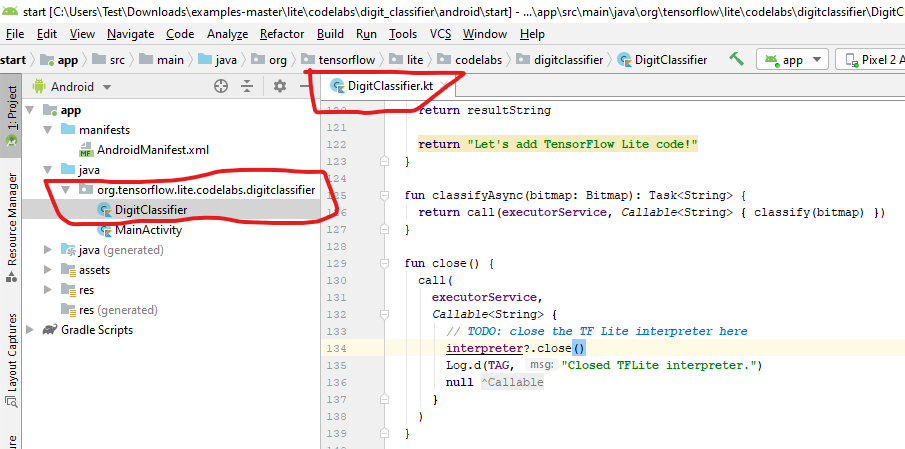

# অ্যান্ড্রয়েড অ্যাপের জন্য "এমনিস্ট" হাতে লেখা ডিজিট চিনতে মডেল ট্রেনিং \(২\)


যেহেতু আমাদের বইয়ের ফোকাস হচ্ছে ডিপ লার্নিং, সেকারণে অ্যান্ড্রয়েড অ্যাপ ডেভেলপমেন্ট নিয়ে মাথা ঘামাবো না বেশি। আর তাই একটা স্কেলিটন সোর্স কোডকে আমাদের মতো করে তৈরি করে নেব বোঝানোর জন্য - কোথায় ডিপ লার্নিং মডেল ব্যবহার করা হয় একটা অ্যাপে। 


**১. অ্যান্ড্রয়েড অ্যাপের একটা স্কেলিটন সোর্সকোড ডাউনলোড** 

শুরুতে আমরা একটা অ্যান্ড্রয়েড স্কেলিটন অ্যাপ এর সোর্স কোড ডাউনলোড করে নেই টেন্সরফ্লো এর গিটহাব এর উদাহরণ পেজ থেকে। লিংক: [https://github.com/tensorflow/examples/archive/master.zip](https://github.com/tensorflow/examples/archive/master.zip)।  সেটাকে আনজিপ করে এক্সট্র্যাক্ট করে নেই একটা ফোল্ডারে। 

**২. অ্যাপের সোর্সকোড ইমপোর্ট করে নিয়ে আসি অ্যান্ড্রয়েড ষ্টুডিওতে**

1. চালু করি অ্যান্ড্রয়েড ষ্টুডিও। 
2. ক্লিক করি "ইমপোর্ট প্রজেক্ট", মানে Import project \(Gradle, Eclipse ADT, etc.\)।
3. একটা ফোল্ডারকে দেখিয়ে দেই যেটা আমরা এক্সট্র্যাক্ট করেছিলাম। ফোল্ডারের নাম হচ্ছে lite/codelabs/digit\_classifier/android/start/
4. ইমপোর্ট প্রসেসটাকে শেষ পর্যন্ত চলতে দিতে হবে। 


**৩. আগে ডাউনলোড করা টেন্সরফ্লো লাইট মডেল রাখতে হবে অ্যাসেট ফোল্ডারে** 

* মনে আছে এমনিস্ট টেন্সরফ্লো লাইট মডেলের ফাইলটার কথা? সেটাকে mnist.tflite কপি করে রেখে দেই আপনার নিজস্ব এক্সট্র্যাক্ট করা lite/codelabs/digit\_classifier/android/start/app/src/main/assets/ ফোল্ডারে। আমারটা ছবিতে দেখুন। ফোল্ডার ব্যাপারটা ইম্পরট্যান্ট, শুরুতে আমার সাথে থাকুন। 

**৪. সোর্সে দেয়া  build.gradle ফাইল দরকার মতো আপডেট করি** 

1. অ্যাপ মডিউলের build.gradle অংশে নিচের ব্লক খুঁজে বের করি। 


```text
dependencies {
  ...
  // TODO: Add TF Lite
  ...
}
```

২.  আমাদের জাভা ক্লাসিফায়ার mnist.tflite ফাইলটাকে অ্যাসেট ফোল্ডার থেকে পড়ে সেটাকে লোড করে ইন্টারপ্রেটারে তার দরকারি ইনফারেন্সের জন্য। এই ইন্টারপ্রেটার আমাদের টেন্সরফ্লো লাইট মডেল আর জাভা ক্লাসের মধ্যে একটা ইন্টারফেস হিসেবে কাজ করে, যেটা দেয়া আছে এই লাইব্রেরিতে। 

আমরা এখানে টেন্সরফ্লো লাইট ব্যবহার করছি সেটা দেখিয়ে দিতে হবে ডিপেন্ডেন্সিতে। যোগ করে দেই নিচের অংশটাকে।  

```text
implementation 'org.tensorflow:tensorflow-lite:1.14.0'
```

৩. এরপর নিচের কোড ব্লকটা খুঁজে বের করি। 

```text
android {
  ...
  // TODO: Add an option to avoid compressing TF Lite model file
  ...
}
```

৪. আমরা যখন অ্যান্ড্রয়েড অ্যাপ বাইনারি বানাবো, টেন্সরফ্লো লাইট মডেলটাকে কমপ্রেস করবো না। আমাদের মডেল ফাইলটা অপ্টিমাইজ না করেই মাত্র কয়েক কিলোবাইট। অবিশ্বাস্য, তাই না! ডান পাশে Sync Now বাটন চাপ দেই। 

**৫. টেন্সরফ্লো লাইট ইন্টারপ্রেটারকে ইনিশিয়ালাইজ করি**

১. আমাদের অ্যান্ড্রয়েড অ্যাপে টেন্সরফ্লো লাইট চালাতে হবে দরকার হবে org.tensorflow.lite.Interpreter জাভা ক্লাস। ডোমেইনে উল্টো দিক থেকে বোঝা সহজ হবে। এখানে আমাদেরকে শুরুতে Interpreter ইনস্ট্যান্সকে ইনিশিয়ালাইজ করে নিতে হবে মডেলের জন্য। 

২. অ্যান্ড্রয়েড স্টুডিওর বাঁ দিকে app মডিউলের নিচে দেখুন DigitClassifier যা আসলে ফাইল হিসেবে DigitClassifier.kt এক্সটেনশন হিসেবে আছে। এখানে আমাদের টেন্সরফ্লো লাইটের কোড যোগ করবো। 

৩. শুরুতে DigitClassifier ক্লাসে একটা ফিল্ড যোগ করি। 

```text
class DigitClassifier(private val context: Context) {
  private var interpreter: Interpreter? = null
  ...
}
```

৪. অ্যান্ড্রয়েড ষ্টুডিও একটা এরর দেবে এখানে। এররটা  হতে পারে Unresolved reference: Interpreter, তবে সেটাকে মেটাবো import org.tensorflow.lite.Interpreter যোগ করে। 

৫. নিচের কোডব্লক খুঁজে বের করি এখানে। 

```text
private fun initializeInterpreter() {
    // TODO: Load the TF Lite model from file and initialize an interpreter.
    ...
}
```

৬. ঠিক তার নিচে যোগ করে দেই নিচের লাইনগুলো। এই লাইনগুলো লোড করবে মডেল ফাইলটাকে। টেন্সরফ্লো লাইট ইন্টারপ্রেটারের একটা ইনস্ট্যান্স চালু হবে এখানে। mnist.tflite ফাইলটা আছে assets ফোল্ডারে। এখানে আমরা টেন্সরফ্লো লাইটকে এমনভাবে কনফিগার করেছি যাতে সে অ্যান্ড্রয়েড এর নিউরাল নেটওয়ার্ক এপিআই ব্যবহার করতে পারে - যদি মডেলের ইনফারেন্সকে স্পিডআপ করতে হার্ডওয়্যার এক্সেলারেশন দরকার হয়। মানে আমরা জিপিইউ এর কথা বলছিলাম। 

৭. নিচের লাইনগুলো যোগ করে দেই // Read input shape from model file অংশের পরে। 

```text
// Read input shape from model file
val inputShape = interpreter.getInputTensor(0).shape()
inputImageWidth = inputShape[1]
inputImageHeight = inputShape[2]
modelInputSize = FLOAT_TYPE_SIZE * inputImageWidth * inputImageHeight * PIXEL_SIZE

// Finish interpreter initialization
this.interpreter = interpreter
```


* `modelInputSize` মানে হচ্ছে কতো বাইট মেমোরি আমরা অ্যালোকেট করবো ইনপুটকে স্টোর করার জন্য যা ব্যবহার হবে টেন্সরফ্লো লাইট মডেলের জন্য।  
* `FLOAT_TYPE_SIZE` এর অর্থ হচ্ছে কত বাইট ইনপুট ডাটা টাইপ এর জন্য দরকার পড়বে। আমরা ব্যবহার করবো float32 মানে ৪ বাইট। 
* `PIXEL_SIZE` বোঝাচ্ছে কতগুলো কালার চ্যানেল ব্যবহার করবো প্রতিটা পিক্সেলের জন্য। যেহেতু আমাদের ইমেজ মনোক্রোম সেকারণে আমরা ব্যবহার করছি ১টা কালার চ্যানেল। 


৮. যেহেতু আমরা টেন্সরফ্লো লাইট ইন্টারপ্রেটারের কাজ শেষ, এটাকে বন্ধ করে দেবো রিসোর্স ফ্রি করে দেবার জন্য। ইন্টারপ্রেটারের লাইফ সাইকেল এক্টিভিটি MainActivity লাইফ সাইকেল এর সাথে সিনক্রোনাইজ হয়ে যাবার পর ইন্টারপ্রেটারকে ক্লোজ করে দেবো। আমরা খুঁজে বের করি নিচের কমেন্টটা। 

```text
// TODO: close the TF Lite interpreter here
```

৯. তারপর যোগ করি নিচের লাইনটা। 

```text
interpreter?.close()
```



