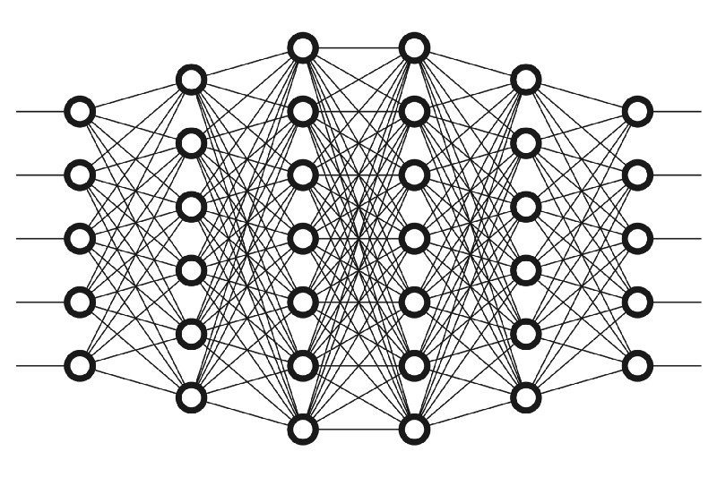

# নিউরাল নেটওয়ার্কের কনসেপ্ট এবং কম্পোনেন্ট

> What people call \#AI is no more than finding answers to questions we know to ask. Real \#AI is answering questions we haven't dreamed of yet.
>
> ― Tom Golway, Hybrid IT and Intelligent Edge Solutions


ডিপ লার্নিং নিয়ে যখন কথা বলি তখন আমাদের চোখের সামনে ভাসে 'ভীতিকর' একটার সাথে আরেকটার লেগে থাকা নিউরাল নেটওয়ার্কের স্ট্যাক। এই ছবিটার মতো। মানে একটার উপর আরেকটা নিউরাল নেটওয়ার্ক। একদম ভয় পাবেন না। এই জিনিস আপনাকে আমাকে করতে হবে না। এটা করবে মেশিন। তবে, সেটা কিভাবে হচ্ছে সেটা নিয়ে আলাপ করবো আজ। 

সত্যি বলতে এই নেটওয়ার্কগুলো বেশ কয়েকটা লেয়ারের হয়ে থাকে। সবচেয়ে বড় কথা হচ্ছে এই লেয়ারগুলো তৈরি হয় 'নোড' দিয়ে। গোল গোল অংশগুলোকে আপাততঃ ধরে নিচ্ছি আমরা। নোডগুলো হচ্ছে এমন একটা জায়গা যেখানে আসল কম্পিউটেশন হয়। ঠিক আমাদের মস্তিষ্কের মত যেখানে পর্যাপ্ত পরিমাণে স্টিমুলি হলেই পরবর্তী লেয়ারে ফায়ার করে। আমাদের এখানে একটা নোড ইনপুট থেকে ডাটার সাথে তার 'করেসপন্ডিং' 'কোএফিশিয়েন্ট' যেটাকে আমরা বলি ওয়েট, যা আমাদের ইনপুটকে দরকার মতো হয় বড় বা ছোট করে।


আমাদের অ্যালগরিদমগুলো ট্রেনিং ডেটা থেকে যে কাজটা শিখতে চাচ্ছে, সেখানে এই ওয়েটগুলো ইনপুটে দরকারি 'সিগনিফিকেন্স' তৈরি করে। 'সিগনিফিকেন্স' হচ্ছে ইনপুটের সাথে এক ধরণের মাল্টিপ্লায়ার - যে ইনপুটকে বেশি বা কম করে বের করে দেয় আউটপুটে। এই আউটপুট হতে পারে পরের লেয়ারের ইনপুট। আমরা বলতে পারি এখানে কোন ইনপুটগুলো সবচেয়ে বেশি সাহায্য করছে একটা ডাটাকে ক্লাসিফাই করতে - সবচেয়ে কম 'এরর' দিয়ে। 

আমাদের এই ইনপুট এবং ওয়েটের প্রডাক্টকে যোগ করে সেটাকে পাঠানো হয় নোডের সামনে - যাকে আমরা বলছি 'অ্যাক্টিভেশন ফাংশন'। এর মধ্যে বায়াস থাকলে সেটাও হবে যোগ অ্যাক্টিভেশনের আগে। এই অ্যাক্টিভেশন ফাংশন এর কাজ হচ্ছে আমাদের পেছনের ইনপুট ডাটা আর সামনে বাড়বে কিনা সেটার একটা সিগন্যাল দেয় যা শেষ আউটকাম নির্ধারণ করে। ধরা যাক, আমরা একটা ক্লাসিফিকেশন করতে চাচ্ছি, তাহলে এই অ্যাক্টিভেশন ফাংশন এমন একটা সিগন্যাল পাঠাবে যা উত্তরের হ্যাঁ অথবা না সিগন্যাল বের করার জন্য সাহায্য করবে। যদি পেছন থেকে সিগন্যালটা সামনে এগিয়ে যায় তাহলে আমরা বলতে পারি নিউরনটা 'অ্যাক্টিভেটেড'।


অনেক গল্প হল, এখন দুটো ছবি দেখি। আমরা যদি একটা 'নোড' এর লেয়ার দেখি, সেখানে একটা নিউরনের মত সুইচ থাকবে যা 'অন' অথবা 'অফ' হয় নেটওয়ার্ক থেকে ইনপুট পেলে। প্রতিটা লেয়ারের আউটপুটগুলো কিন্তু পাশাপাশি পরের লেয়ারের ইনপুট হিসেবে কাজ করে। ইনপুটের ডাটার সাথে তার ওয়েট সেই ইনপুটের জন্য 'সিগনিফিকেন্স' তৈরি করে। ইনপুট এবং ওয়েটের ডট প্রোডাক্টের যোগফল পাঠানো হয় অ্যাক্টিভেশন ফাংশনে।


**ডিপ নিউরাল নেটওয়ার্কের কিছু দরকারি কনসেপ্ট**


যদিও আমরা এখানে একটা সিঙ্গেল লেয়ার নিয়ে কাজ করছি, তবে ডিপ লার্নিং নেটওয়ার্কে ইনপুট এবং আউটপুট লেয়ারের মধ্যে অনেকগুলো হিডেন লেয়ার থাকতে পারে। যেটাকে আমরা নেটওয়ার্কের ডেপথ বলতে পারি। যত বেশি নোডের লেয়ার এর ভেতর দিয়ে ডাটা পার হবে, ততগুলো প্যাটার্ন রিকগনিশন এর প্রসেস চলতে থাকবে এই হিডেন লেয়ার গুলোতে।


শুরুর দিকের নিউরাল নেটওয়ার্ক গুলো র গভীরতা বেশি ছিল না কারণ এইযে পার্সপ্ট্রন, যেটার মধ্যে একটা ইনপুট আরেকটা আউটপুট লেয়ার, খুব বেশি হলে একটা হিডেন লেয়ার থাকতে পারে এর মধ্যে। আমাদের একটা ধারণা আছে তিনটা লেয়ারের বেশি একটা নেটওয়ার্ক, \(যার মধ্যে ইনপুট এবং আউটপুট লেয়ার সহ\) তাকে আমরা বলতে পারি একটা ডিপ লার্নিং নেটওয়ার্ক। মোদ্দাকথা একটার বেশি হিডেন লেয়ার থাকলেই সেটা ডিপ লার্নিং নেটওয়ার্ক।

