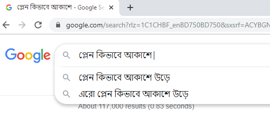
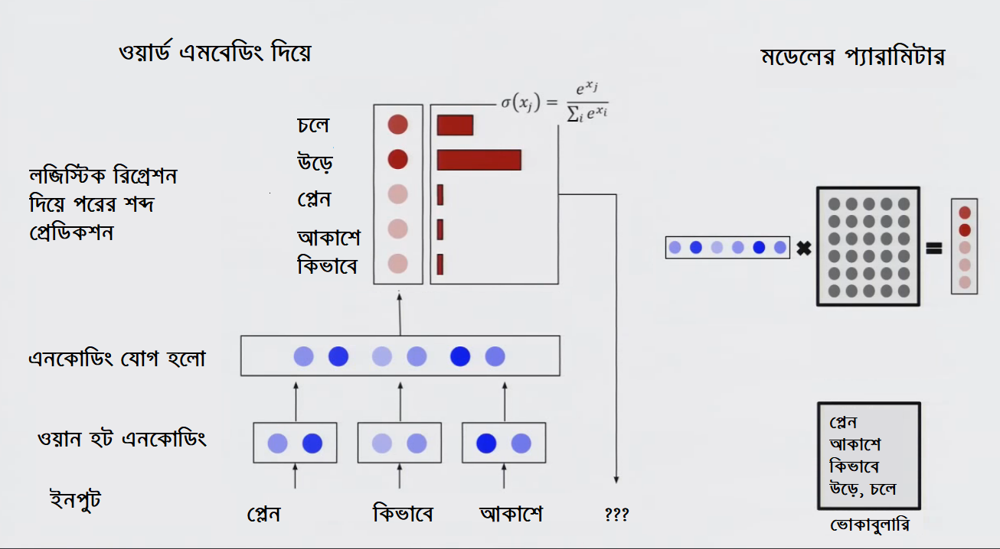

# সার্চে এমবেডিং: পরের শব্দটা কি হবে?

আচ্ছা , বলুন তো - কোথায় ওয়ার্ড এম্বেডিং এর ব্যবহার নেই? তবে সেই গল্প দেবার আগে অন্য গল্প বলি। আমরা সবাই প্রশ্নের উত্তর খুঁজছি। প্রশ্নের পাশাপাশি বিভিন্ন প্রোডাক্ট অথবা দরকারি জিনিসপত্র খুঁজছি অনলাইনে। আগে আমরা যখন সার্চ ইঞ্জিনে প্রশ্ন করতাম, আমাদের কষ্ট কমানোর জন্য প্রশ্ন লেখার শুরুর পর থেকে অটো কমপ্লিশন ফিচার - কি প্রশ্ন করতে পারি সেটার শুরুর দেখেই পুরো প্রশ্নটাকে কমপ্লিট করত। এখন এসেছে পরের ধাপ। গুগল আপনার সচরাচর প্রশ্নের উত্তর ওয়েবসাইটে না পাঠিয়ে নিজেই উত্তর দেবার চেষ্টা করছে। আমরা দেখেছি সেই ট্রেন্ড। সেটা বাড়ছে আরো বেশি। 


জীবনের প্রশ্ন সহ অন্য অনেক প্রশ্নের উত্তর খুঁজতে আমি প্রায়ই যাই ‘কোরা’ ওয়েবসাইটে। প্রোগ্রামিং অথবা মেশিন লার্নিং নিয়ে সমস্যায় পড়লে ‘স্ট্যাক ওভারফ্লো’ ওয়েবসাইট। প্রশ্নের পাশাপাশি তারা রিকমেন্ড করে কাছাকাছি ধরনের প্রশ্নগুলোকে। ফলে দেখা যায় যে মূল প্রশ্নের উত্তরে ঠিক উত্তরটা না পেলেও অন্য প্রশ্নের উত্তরে সেটা পাওয়া যায়। এগুলো কিভাবে করছে তারা? ওয়ার্ড এম্বেডিং। আগেকার সার্চ মডেল পাল্টে যাচ্ছে এই ওয়ার্ড এম্বেডিং এর কারণে। 

আস্তে আস্তে অনেকেই জিমেইলে ফেরত আসছেন এর অসাধারণ অটো কমপ্লিশন ফিচারের কারণে। আমি বাক্যের শুরুটা কোনরকমে ধরলেই সে সাজেস্ট করছে কিভাবে পুরো বাক্যটা লিখতে হবে। ডানের অ্যারো চিহ্ন চাপলেই লেখা হয়ে যাচ্ছে পুরো বাক্যটা। ইমেইল এর মাঝখানে এবং শেষের দিকে কি ধরনের কথাগুলো লেখা হতে পারে সেগুলো বলে দিচ্ছে আগে থেকে। কিভাবে হচ্ছে এগুলো? ওয়ার্ড এম্বেডিং।

সাইট হিসেবে ‘কোরা’ অথবা বিভিন্ন সাইট চাইবেই ব্যবহারকারীরা তাদের সাইটে বেশিক্ষণ থাকেন। সে কারণে যে প্রশ্নটা ব্যবহারকারী করেছেন সেই প্রশ্নটা হুবহু একই রকম না হলেও তারা চাইবে কাছাকাছি ধরণের প্রশ্নগুলোকে উপস্থাপন করতে। আমরা ধরে নিতে পারি এই মুহূর্তে কোরার কাছে প্রায় দেড় কোটি প্রশ্ন এবং উত্তর আছে। সে চাইবে তার নতুন ব্যবহারকারীর প্রশ্নগুলোকে এর মধ্যে সংযুক্ত করতে। প্রশ্নগুলোর বাক্যের গঠন একই রকম না হলেও কাছাকাছি বাক্যগুলো দিয়ে এমনভাবে দেখাবে তারা যাতে বেশি উত্তর দেখাতে পারে। 

এখানে কোরা কি করছে? এই দেড় কোটি প্রশ্নগুলোকে একটা ‘লার্নড স্পেসে’ সবগুলো অবজেক্টকে ‘কন্টিনিউয়াস ভেক্টর’ দিয়ে রিপ্রেজেন্ট করছে। সেখানে কাছাকাছি প্রশ্নগুলোকে কাছাকাছি সংখ্যা দিয়ে পাশাপাশি রাখছে। নতুন প্রশ্নের ক্ষেত্রে তারা এমনভাবে এনকোড করছে যাতে তারা ওই প্রশ্নগুলোর ‘নিয়ারেস্ট নেইবার’কে ঠিকমতো খুঁজে পায়।


আমরা এখানে একটা উদাহরণ দেখি। আমি সার্চ করতে চাই - ‘প্লেন কিভাবে আকাশে উড়ে’? শুরু করলাম শব্দগুলো দিয়ে। দেখা গেল সে বাকিটা সাজেস্ট করছে সে। আমি ‘উড়ে’ না লিখলেও সে সাজেস্ট করছে সেটা। ডিপ লার্নিং এ ব্যাপারটা কিভাবে ঘটছে?

আমরা এখানে একটা ল্যাঙ্গুয়েজ মডেলিংয়ের সমস্যা নিয়ে আলাপ করি। সমস্যাটা হচ্ছে বর্তমান কনটেক্সটে তিনটা শব্দ দিয়ে - আমাদেরকে শেষ শব্দটাকে প্রেডিক্ট করার জন্য বলা হচ্ছে। ধরা যাক এই সমস্যাটাকে খুব ছোট্ট একটা ভোকাবুলারি ডিকশনারি দিয়ে সমাধান করতে যাচ্ছি। আমাদের ভোকাবুলারিতে আছে পাঁচটা শব্দ। সত্যিকারের সমস্যায় আমরা হয়তোবা কয়েক লক্ষ শব্দ দিয়ে তৈরি ভোকাবুলারি ব্যবহার করব। এই সমস্যাকে আমরা সাধারন ‘লজিস্টিক রিগ্রেশন’ দিয়ে সমাধান করতে পারি।

সাধারণ ‘লজিস্টিক রিগ্রেশন’ দিয়ে কাজ করতে গেলে প্রথমে সবাই বলবেন আমাদের ইনপুট প্রশ্নকে ‘ওয়ান হট এনকোডিং’ দিয়ে ‘এনকোড’ করার জন্য। এখানে প্রতিটা শব্দকে এনকোড করার পর সেটাকে যোগ করে নিচ্ছি উপরের লেয়ারে। ঠিকমতো রিপ্রেজেন্টেশন করার জন্য। আমরা বলতে পারি এই কন্টেক্সটকে ১৫টা ডাইমেনশনে রিপ্রেজেন্ট করা হচ্ছে এই শব্দগুলোকে। 

নিচের ছবি দেখুন। পনেরোটা ফিচার। এদের কাজ হচ্ছে আমাদের সামনের শব্দটাকে ঠিকমতো প্রেডিক্ট করা। আমাদের যেহেতু ভোকাবুলারিতে পাঁচটা শব্দ আছে এখন কোন শব্দটা এখানে ঠিকমতো ম্যাচ করবে সেটাই বের করবে লজিস্টিক রিগ্রেশন। ডান পাশের মডেল প্যারামিটারে ভোকাবুলারির প্রতিটা শব্দের স্কেলার ভ্যালুর সাথে গুন করে প্রতিটার প্রবাবিলিটি ডিস্ট্রিবিউশন পাব এই ভোকাবুলারির প্রতিটা শব্দের উপর। এখানে দেখা যাচ্ছে অন্যসব শব্দ থেকে “উড়ে” শব্দটার প্রবাবিলিটি সবচেয়ে বেশি।

এই একই জিনিসটা করা যাচ্ছে ওয়ার্ড এম্বেডিং দিয়ে। প্রতিটি শব্দকে আমরা দুটো প্যারামিটার দিয়ে তৈরি করে দেবো। এরপর আমরা সেই শব্দগুলোকে ‘লুক আপ’ করব আমাদের এম্বেডিং টেবিলে তার আসল ভ্যালু এর জন্য। এরপর আমরা সেটাকে যুক্ত করে দেব ইনপুট লেয়ারে সহজ প্রসেসিংয়ের জন্য। বাকি এলিমেন্টগুলো আগের ‘ওয়ান হট ভেক্টর’ মডেলের মত। আগের মডেলের পনেরোটা প্যারামিটার এর জায়গায় এখন সেটা দাঁড়িয়েছে ছয়টায়। এখানে আমাদের ফিচারগুলো শিখে নিচ্ছে মডেল।

তো, ট্রেনিংয়ে কি হবে? আগের মডেলের ইনপুট দিয়ে তার পরের শব্দটাকে প্রেডিক্ট করতে চাচ্ছিলাম। আমাদের যেহেতু উদাহরনে শব্দের সিকোয়েন্সগুলো দেয়া আছে, সে কারণে ট্রেনিং ডাটাকে ব্যবহার করব মডেল প্যারামিটারগুলোকে এস্টিমেট করার জন্য। সেখানে “উড়ে” শব্দটার প্রবাবিলিটি ডিস্ট্রিবিউশন অন্য শব্দগুলো থেকে বেশি হবার কারণে ‘লজিস্টিক রিগ্রেশন’এ “উড়ে” শব্দটা ১ হয়ে যাবে, বাকিগুলো থাকবে 0 হিসেবে। এখন দুটো লেভেলের ডিস্ট্রিবিউশন এখানে যেমন বাম এর ছবি আর ডানের ছবি দুটোতে ‘ক্রস এনট্রপি’ দিয়ে মডেলকে আপডেট দেয়া যাবে। এখানে ‘ব্যাক প্রপাগেশন’ এর ছবিটা দিচ্ছি না আর। বড় স্কেলে আমরা এই ইনপুটগুলোকে ঢুকিয়ে দিব নিউরাল নেটওয়ার্কে।


পুরো ভিডিওটা দেখতে চাইলে বার্কলি স্কুল অফ ইনফরমেশনের ভিডিওটা দেখতে পারেন। গুগলের ড্যান গিলিকের ভিডিও। লিংক https://youtu.be/JGHVJXP9NHw


