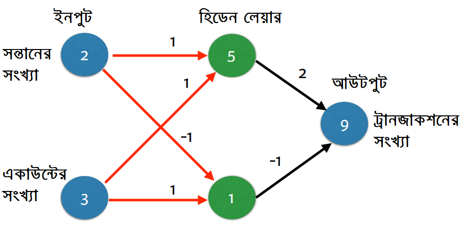
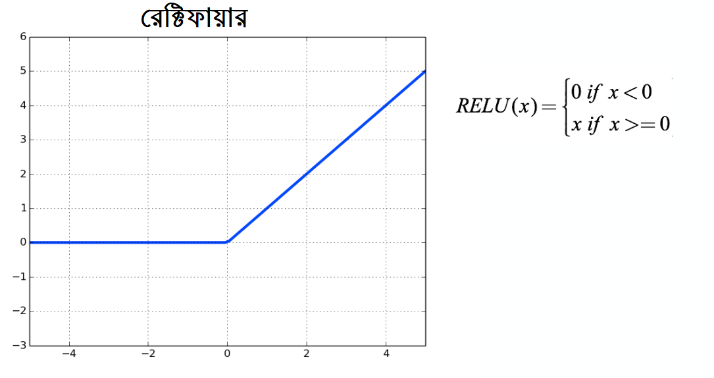

# ডিপ লার্নিং নেটওয়ার্ক: ফরওয়ার্ড এবং নেটওয়ার্ক অপটিমাইজেশনের জন্য ব্যাক প্রোপাগেশন


ড্যান বেকার আমার প্রিয় একজন মেন্টর। ক্যাগলের অনেক কিছুই শিখেছি তার কাছ থেকে। সেদিক থেকে ডাটাক্যাম্প আরেকটা প্রিয় লার্নিং প্ল্যাটফর্ম। ড্যান বেকারের চমত্কার একটা কোর্স থেকে নিচের উদাহরনটা নিচ্ছি এখানে। কোর্সের লিংক দেয়া আছে বইয়ের পেছনে। 


আমরা নিউরাল নেটওয়ার্কের প্রেডিকশন যখন করি, তখন আসলে ফরওয়ার্ড প্রপাগেশন অ্যালগরিদম ব্যবহার করি। সেটা হাতেকলমে দেখলে কেমন হয়? আমি উদাহরনটা হুবুহু রেখেছি যাতে ভবিষ্যতে উনার কোর্স ধরতে অসুবিধা না হয়।

আমাদের উদাহরণে একজন ব্যবহারকারী কতগুলো ট্রানজাকশন করতে পারেন সেটা নিয়ে আলাপ হবে। বোঝার সুবিধার্থে শুরুতেই আমরা সেই ব্যবহারকারীর সন্তানদের সংখ্যা এবং তার কতগুলো নিজস্ব একাউন্ট আছে সেটার ওপর নির্ভর করে প্রেডিকশন করব তার কতগুলো ব্যাংক ট্রানজেকশন হতে পারে। শুরুতে একটা ছবি দেখি যেখানে ইনপুট হিসেবে সন্তানদের সংখ্যা এবং অ্যাকাউন্ট সংখ্যা - আর আউটপুট হিসেবে আমরা ব্যাংকের ট্রানজেকশন দেখাচ্ছি। 

এখানে ইনপুট লেয়ার থেকে লাইন টেনে হিডেন লেয়ারে সংযোগ দিয়ে দেখাচ্ছি সবগুলোর মধ্যে যোগসূত্রের ব্যাপারটা। এখানে প্রতিটা লাইনের সাথে একটা করে ‘ওয়েট’ যোগ করা আছে যার মাধ্যমে বোঝা যাবে সেই ইনপুট তথ্যটা কতটুকু বাড়লো সেই লাইনের শেষে। আপনি যদি ভালোভাবে দেখেন হিডেন লেয়ারে যখন লাইনগুলো যাচ্ছে সেখানে উপর দিক থেকে একটা ‘ওয়েট’ এবং নিচ থেকে আরেকটা ‘ওয়েট’, অর্থাৎ সন্তান সংখ্যা থেকে একটা ‘ওয়েট’ আর অ্যাকাউন্টের সংখ্যা থেকে আরেকটা ‘ওয়েট’ এসে যুক্ত হচ্ছে সেখানে। 

এই ওয়েটগুলো আমাদের ট্রেনিং এর শুরুতে একরকম থাকলেও যখন নেটওয়ার্কে ট্রেনিং চালাবো তখন সেই ফিট মেথডে ‘ওয়েট’ পাল্টে যেতে পারে। আমাদের ডিপ লার্নিং এ এই শুরুর ‘ওয়েট’ এবং ট্রেনিং এর সময় ‘ওয়েট’ পাল্টে যাওয়ার ধারণাটা বুঝতে পারলেই ডিপ লার্নিং ব্যাপারটা অনেক সহজ হয়ে যাবে। 

ভালো করে লক্ষ্য করুন, আমরা যদি হিডেন লেয়ারের উপরের নোড থেকে যদি প্রেডিকশন করতে চাই তাহলে প্রতিটা ইনপুট নোডের ভ্যালু নিয়ে সেটাকে গুন করব তার ওয়েট দিয়ে, যেটা কানেক্ট করছে সেই হিডেন লেয়ারকে। এরপর সেই ভ্যালুগুলোকে যোগ করে দেব সেই উপরের হিডেন লেয়ারে। আপনারা দেখতে পাচ্ছেন উপরের হিডেন লেয়ারে ইনপুট নোড এর ভ্যালুর সাথে ওয়েট গুন করে এবং তার ফলাফল গুলোকে যোগ করে তার রেজাল্ট আউটপুট হিডেন লেয়ারে ৫ হিসেবে এসেছে। সেই একই সিস্টেমে নিচের হিডেন লেয়ারে ফলাফল এসেছে ১, কারণ এখানে ওয়েট হিসেবে একটা ঋণাত্মক সংখ্যা \(-১\) ছিল। 

এভাবে আগের মত একই প্রসেস ব্যবহার করব আউটপুট লেয়ারের জন্য। এখানে উপরের হিডেন লেয়ার থেকে আউটপুট লেয়ারের কানেক্টেড লিঙ্কের ওয়েট হচ্ছে ২ এবং নিচের হিডেন লেয়ার থেকে আউটপুট লেয়ারের ওয়েট হচ্ছে -১। এখানেও হিডেন লেয়ারের ৫ এবং ১কে ইনপুট ধরে তার সাথে ওয়েটগুলোকে গুন করে এবং তার ফলাফলকে যোগ করলে আসে সংখ্যা ৯। এর মানে হচ্ছে আমাদের ওই ব্যবহারকারীর জন্য প্রেডিকশন হচ্ছে ৯টা ট্রানজাকশন। এটাকে আমরা বলছি ফরওয়ার্ড প্রপাগেশন। 



মোদ্দা কথা হচ্ছে - আমরা ইনপুট লেয়ার থেকে এসেছি হিডেন লেয়ারে, এরপর সেই হিডেন লেয়ার থেকে এসেছি সর্বডানের আউটপুট লেয়ারে। আমরা এখানে শুরুতে গুন করেছি ভ্যালুগুলোকে, এরপরে সেগুলোকে যোগ করে দিয়েছি রেজাল্ট পাবার জন্য। আমরা যখন লিনিয়ার অ্যালজেব্রা বা ভেক্টর অ্যালজেব্রা নিয়ে কাজ করেছি - সেখানে এই ব্যাপারটাকে বলা হয় ডট প্রডাক্ট। এই ডট প্রডাক্ট না জানলেও হবে আমাদের। এখানে এতক্ষণ আমরা যা করলাম সেটা একটা অর্থাৎ একটা ডাটা পয়েন্ট থেকে ফরওয়ার্ড প্রপাগেশন ব্যবহার করলাম। এভাবে ডিপ লার্নিং মডেলে ওই একটা সময়ে একটা ডাটা পয়েন্ট থেকে ফরওয়ার্ড প্রপাগেশন করি আমরা।

এই পুরো ব্যাপারটাকে আমরা একটু কোড এ দেখি। শুরুতেই অংকের বিভিন্ন অপারেশনের জন্য নামপাইকে ইমপোর্ট করে নিয়ে আসি। ইনপুট ডাটা হিসেবে সন্তানের সংখ্যা এবং অ্যাকাউন্টের সংখ্যা দেওয়া হচ্ছে নামপাই অ্যারে হিসেবে। এরপরে আমরা ওয়েটগুলোকে ভাগ করে দিচ্ছি বিভিন্ন নোডে এবং আউটপুট লেয়ারে। আমাদের এই ভ্যালুগুলোকে একটা ডিকশনারি বানিয়ে সেখানে অ্যারে হিসেবে রাখছি। 

```text
import numpy as np

# আমাদের প্রেডিকশন করার জন্য ডেটা পয়েন্ট, ছবির সাথে মিলিয়ে দেখুন
input_data = np.array([2, 3])

# আমাদের ডিকশনারী
weights =   {'node_0': np.array([1, 1]),
             'node_1': np.array([-1, 1]),
             'output': np.array([2, -1])
            }
```

শুরু করছি আমাদের ফরওয়ার্ড প্রপাগেশন। শুরুতে আমাদের নোড ০। যেটা আসলে আমাদের উপরের হিডেন নোড, সেটাকে অংকের মাধ্যমে নিয়ে আসি এখানে। এখানে ফর্মুলা হিসেবে ইনপুট এবং ওয়েটকে গুণ করি সেই নোড এর জন্য। সে দুটোর রেজাল্টকে যোগ করে দেই শেষে। মনে আছে আমাদের নোড ০ এর জন্য দুটো ওয়েট ছিল? আমাদের দুটো ওয়েটকেই গুন করতে হবে সেই ইনপুট ডাটার সাথে। 

এই একই জিনিস এখন আমরা করব নিচের হিডেন লেয়ারের নোড এর জন্য। যেটাকে আমরা বলছি নোড ১। এখন আমাদের নোড ০ এবং নোড ১ এর জন্য দুটো সংখ্যা এসেছে। আমাদের সামনে মাল্টিপ্লিকেশন সহজ করার জন্য আমরা দুটোকে একটা অ্যারেতে রাখছি। আমাদের বোঝার সুবিধার জন্য সেই অবজেক্টকে প্রিন্ট করে দেখি সেটা ঠিক বলছে কিনা? ৫, ১। 

```text
# node 0 এর ভ্যালু ক্যালকুলেট করি: node_0_value
node_0_value = (input_data * weights['node_0']).sum()

# node ১ এর ভ্যালু ক্যালকুলেট করি: node_1_value
node_1_value = (input_data * weights['node_1']).sum()

# নোডগুলোর ভ্য়ালুগুলোকে অ্যারেতে রাখি: hidden_layer_outputs
hidden_layer_outputs = np.array([node_0_value, node_1_value])

# আউটপুট ক্যালকুলেট করি: output
output = (hidden_layer_outputs * weights['output']).sum()

# আউটপুট প্রিন্ট করে দেখি
print(output)
9
```

এখন আসি আমদের আউটপুট এর ব্যাপারে। হিডেন লেয়ারের ভ্যালুগুলোকে গুণ করতে হবে তার এসোসিয়েটেড ওয়েট দিয়ে। সেই গুণফলগুলোকে যোগ করলে তার উত্তর আসে ৯। ১০- ১= ৯। আর বাকি থাকে কি? ফরওয়ার্ড প্রপাগেশন বোঝা শেষ। আমাদের এই ছোট্ট এই নিউরাল নেটওয়ার্কের। 

#### এক্টিভেশন ফাংশন, লিনিয়ারিটি এবং নন-লিনিয়ারিটি 

এতক্ষণ আমরা যা করলাম সেটা হয়তোবা ডট প্রডাক্ট হিসেবে কাজ করবে - তবে এ ধরনের সিদ্ধান্ত নিতে গেলে ডিপ লার্নিং মডেলে নন-লিনিয়ারিটি সমস্যা সমাধান করতে হবে। আগেই বলেছি নিউরাল নেটওয়ার্কে তার আসল ক্ষমতা দেখাতে হলে এখানে একটা 'অ্যাক্টিভেশন ফাংশন' ব্যবহার করতে হবে। কেন ব্যবহার করতে হবে সেটা আপনারা দেখেছেন চাঁদ আকারের ডাটা সেটে। এই অ্যাক্টিভেশন ফাংশনই পারে ডাটাতে নন-লিনিয়ারিটি বুঝতে।
এই এক্টিভেশন ফাংশন ব্যবহার করবো প্রতিটা নোডে, যখন দরকার পড়বে। 


রেল্যু ফাংশন হচ্ছে ইনপুট হিসেবে যা দেবেন, সেটা যদি নেগেটিভ অর্থাৎ ঋনাত্বক সংখ্যা হয় তাহলে সে "০" রিটার্ন করবে। তবে ০ ছাড়া ইনপুট হিসেবে যদি পজিটিভ সংখ্যা থাকে তাহলে ওই সংখ্যাই রিটার্ন করবে। উদাহরণ,  **relu\(3\) = 3** এবং **relu\(-3\) = 0**




```text
def relu(input):
    '''রেল্যু ফাংশনকে ডিফাইন করে দিচ্ছি এখানে'''
    # ইনপুটে যা পাবো সেটাকে ম্যাক্সিমাম যা আসবে, অথবা ঋনাত্বক আসলে "০" : output
    output = max(0, input)
    
    # Return the value just calculated
    return(output)

# Calculate node 0 value: node_0_output
node_0_input = (input_data * weights['node_0']).sum()
node_0_output = relu(node_0_input)

# Calculate node 1 value: node_1_output
node_1_input = (input_data * weights['node_1']).sum()
node_1_output = relu(node_1_input)

# Put node values into array: hidden_layer_outputs
hidden_layer_outputs = np.array([node_0_output, node_1_output])

# Calculate model output (do not apply relu)
model_output = (hidden_layer_outputs * weights['output']).sum()

# Print model output
print(model_output)
```

#### ব্যাকওয়ার্ড প্রোপাগেশন 

```text
import numpy as np

# আমাদের প্রেডিকশন করার জন্য ডেটা পয়েন্ট, ছবির সাথে মিলিয়ে দেখুন
input_data = np.array([0, 3])

# Sample weights
weights_0 = {'node_0': [2, 1],
             'node_1': [1, 2],
             'output': [1, 1]
            }

# The actual target value, used to calculate the error
target_actual = 3

def relu(input):
    output = max(0, input)
    return output

def predict_with_network(input_data_row, weights):
    node_0_input = (input_data_row * weights['node_0']).sum()
    # print(node_0_input)
    node_0_output = relu(node_0_input)
    # print(node_0_output)

    node_1_input = (input_data_row * weights['node_1']).sum()
    node_1_output = relu(node_1_input)
    
    hidden_layer_outputs = np.array([node_0_output, node_1_output])
    
    input_to_final_layer = (hidden_layer_outputs * weights['output']).sum()
    model_output = relu(input_to_final_layer)
    return model_output
       

# Make prediction using original weights
model_output_0 = predict_with_network(input_data, weights_0)

# Calculate error: error_0
error_0 = model_output_0 - target_actual

# Create weights that cause the network to make perfect prediction (3): weights_1
weights_1 = {'node_0': [2, 1],
             'node_1': [1, 2],
             'output': [1, 0]
            }

# Make prediction using new weights: model_output_1
model_output_1 = predict_with_network(input_data, weights_1)

# Calculate error: error_1
error_1 = model_output_1 - target_actual

# Print error_0 and error_1

#print(node_1_input)
#print(node_1_output)
#print(hidden_layer_outputs)
#print(input_to_final_layer)
#print(model_output)


print(model_output_0)
print(model_output_1)
print(error_0)
print(error_1)

```

